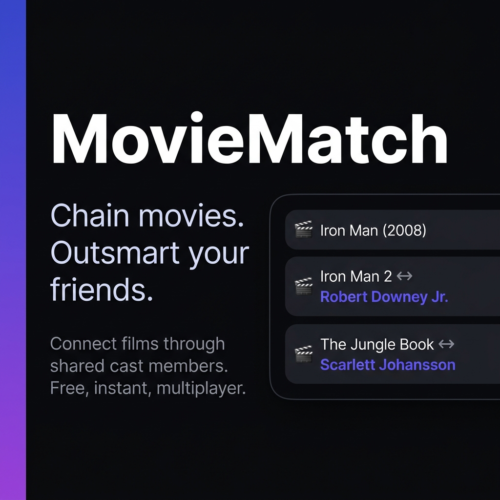

<div align="center">

# MovieMatch

[](https://nodejs.org/)
[](https://expressjs.com/)
[](https://socket.io/)
[](https://redis.io/)
[](/)

**Real-time multiplayer trivia game — chain movies and TV shows through shared cast members. Last player standing wins.**

[Live Demo](https://moviematch.it.com) · [Report a Bug](https://github.com/Itsbryanfam/MovieMatch/issues)



</div>

---

## Overview

MovieMatch is a full-stack real-time game built on Node.js, Socket.io, and Redis. Players take turns naming a movie or TV show that shares at least one cast member with the previous title. Get it wrong, run out of time, or disconnect for too long — you're eliminated. The last player standing wins.

Every submission is validated server-side against live TMDB cast data, preventing any client-side cheating. The game state is entirely authoritative and Redis-backed, making it horizontally scalable.

---

## Game Modes

| Mode | Description |
| :--- | :--- |
| **Classic** | Last player standing. Timer shrinks every two successful plays, increasing pressure throughout the game. |
| **Team (2v2)** | Two teams submit back-to-back. One failed connection eliminates the entire team. |
| **Solo** | Single-player survival — build the longest chain possible. |
| **Speed** | Fixed 15-second timer for every turn. No exceptions. |

**Optional modifiers:** Hardcore Mode (no reusing the same connecting actor consecutively) and TV Show support (expands the pool via TMDB `aggregate_credits`).

---

## Features

**Gameplay**
- Server-authoritative move validation against full TMDB cast lists
- Adaptive turn timer that shrinks as the game progresses
- 15-second reconnection grace period — disconnecting mid-game doesn't immediately eliminate you
- Page-refresh recovery via `sessionStorage` and persistent stable player IDs (`localStorage`)

**Matchmaking & Social**
- Public lobby browser for open matchmaking
- Private rooms with shareable invite links
- Spectator mode with automatic promotion to player at round end
- Real-time lobby chat and emoji reactions
- Host controls: kick players, configure game mode and modifiers before the match
- Shareable PNG recap cards of the full movie chain

**Infrastructure**
- Redis-backed distributed lock (`SET NX PX`) prevents race conditions during concurrent move submissions
- Per-socket Redis rate limiting on all events (join, submit, chat, reactions)
- XSS protection — all user content written via DOM APIs, never `innerHTML`
- Graceful shutdown with Redis drain on `SIGTERM`/`SIGINT`
- In-memory poster cache with 30-minute background refresh
- 47 tests across 5 suites covering game logic, socket integration, reconnection, and validation

---

## Architecture

```
client (Vanilla JS ES modules)
  ├── app.js          — input wiring, DOM event binding
  ├── socketClient.js — socket event handlers, screen transitions
  ├── ui.js           — all DOM rendering (no state ownership)
  ├── state.js        — single source of truth for client state
  └── utils.js        — audio synthesis, stable ID, shared utilities

server (Node.js / Express 5)
  ├── server.js               — HTTP server, Redis adapter, startup
  ├── socketHandlers.js       — socket event routing, rate limiting
  ├── gameLogic.js            — win conditions, turn timers, elimination
  ├── redisUtils.js           — all Redis I/O
  └── systems/
      ├── lobbySystem.js      — lobby lifecycle, reconnection grace period
      └── matchSystem.js      — TMDB search, move validation, chain building
```

State is stored entirely in Redis as serialized lobby objects, enabling stateless server processes and straightforward horizontal scaling behind a Socket.io Redis adapter.

---

## Getting Started

**Prerequisites:** Node.js 18+, Redis 7+, and a [TMDB API read token](https://developer.themoviedb.org/docs/getting-started).

```bash
git clone https://github.com/Itsbryanfam/MovieMatch.git
cd MovieMatch
npm install
```

Create a `.env` file:

```env
TMDB_READ_TOKEN=your_tmdb_read_token_here
REDIS_URL=redis://localhost:6379
FRONTEND_URL=http://localhost:3000
```

```bash
npm start        # production
npm test         # run test suite (47 tests)
```

Open [http://localhost:3000](http://localhost:3000).

---

## Deployment

Designed for PaaS deployment (tested on Render):

1. Deploy as a **Node.js Web Service**
2. Provision a **Redis** instance
3. Set `TMDB_READ_TOKEN`, `REDIS_URL`, and `FRONTEND_URL` environment variables

For multi-instance deployments, the Socket.io Redis adapter handles cross-process event broadcasting automatically.

---

## Tech Stack

| Layer | Technology |
| :--- | :--- |
| Runtime | Node.js 18+ |
| Framework | Express 5 |
| Real-time | Socket.io 4 with Redis adapter |
| State store | Redis 7 |
| External API | TMDB (The Movie Database) |
| Frontend | Vanilla JS (ES modules), no build step |
| Testing | Jest — unit, integration, socket tests |

---

<div align="center">
Built by <a href="https://x.com/ItsBryanFam"><strong>Bryan Cortez</strong></a>
</div>
